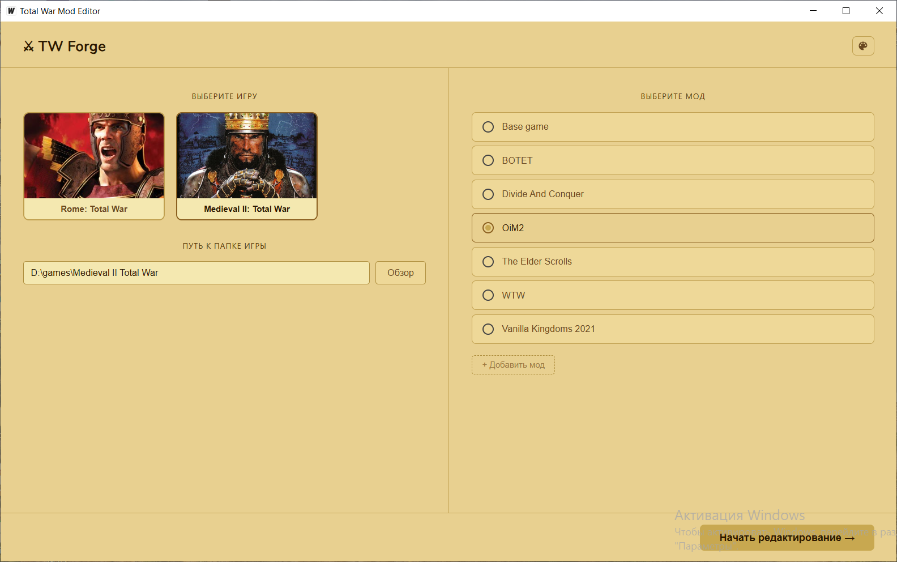
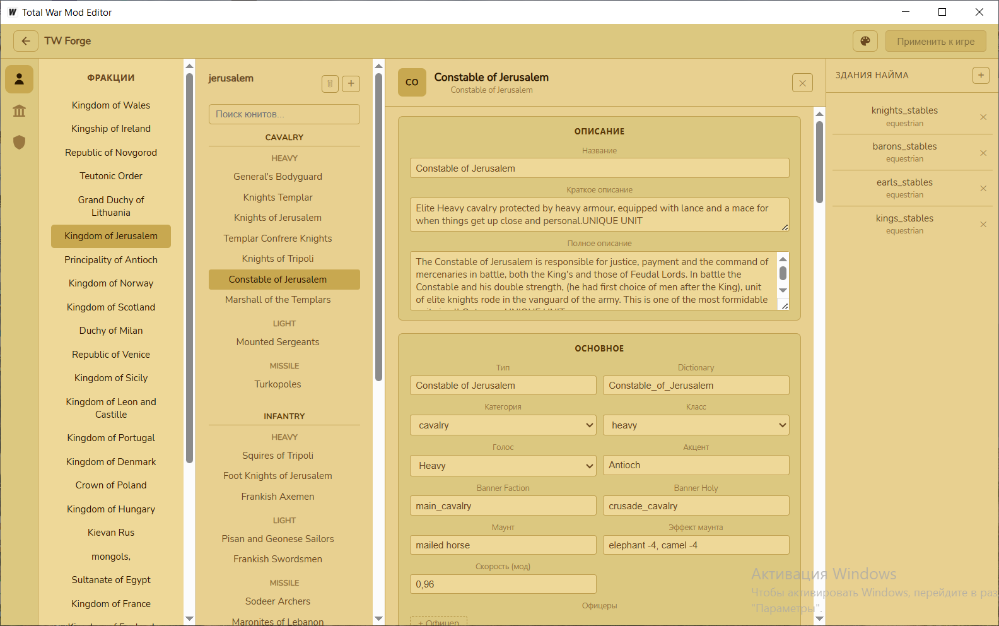
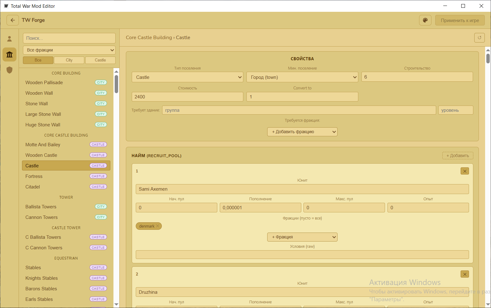
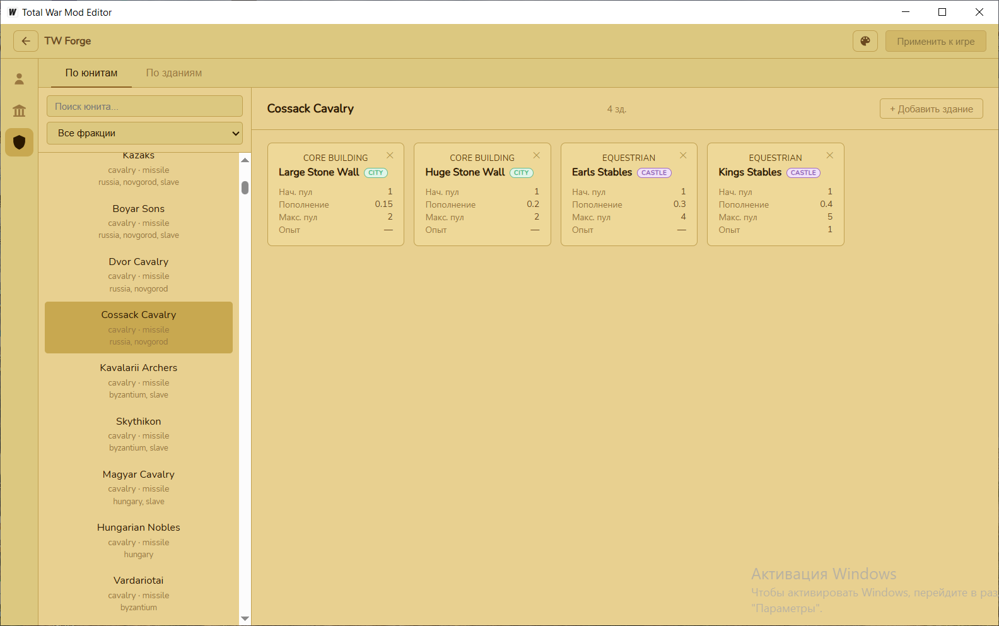

# TW Forge

[English version](README.md)

Визуальный редактор модов для **Rome: Total War** и **Medieval II: Total War**.

Позволяет редактировать юниты, здания и очереди найма без ручного разбора текстовых файлов игры.

| | |
|---|---|
|  |  |
|  |  |

---

## Возможности

### Юниты

- Просмотр и редактирование всех характеристик юнита: статы, оружие, броня, формация, стоимость, атрибуты
- Редактирование имени и описания юнита
- Создание нового юнита на основе шаблона (копия существующего)
- Копирование юнита в другую фракцию — иконка и запись в `battle_models.modeldb` копируются автоматически
- Удаление юнита: мягкое (убрать из фракции) и полное (удалить из EDU + иконки)
- Откат изменений по отдельному юниту
- Управление иконками и 3D-моделями (.cas / .tga / .dds) через вкладку Assets (пока работает нестабильно, использовать на свой страх и риск)

### Здания

- Просмотр и редактирование дерева зданий
- Редактирование параметров уровня: стоимость, время постройки, тип поселения, бонусы
- Управление зависимостями между зданиями
- Откат всех изменений зданий

### Очередь найма

Двухрежимный редактор:

- **По юниту** — какие здания нанимают выбранного юнита, добавить/удалить здание, настроить параметры пула
- **По зданию** — какие юниты нанимаются на каждом уровне, добавить/удалить юнита, настроить параметры пула

Параметры пула: начальный пул, скорость пополнения, максимальный пул, получаемый опыт, условия.

### Применение изменений

Все изменения накапливаются в памяти и не трогают файлы игры до явного подтверждения.  
Кнопка **Apply to Game** (**Применить к игре**) записывает изменённые файлы в папку мода.

---

## Поддерживаемые игры

| Игра | Статус |
|------|--------|
| Rome: Total War | ✓ |
| Medieval II: Total War | ✓ |

---

## Установка

1. Скачать `tw-forge.exe` со страницы [Releases](https://github.com/Elkariot/TW-Forge/releases)
2. Запустить — установка не требуется

**Требования:** Windows 10/11, WebView2 (устанавливается автоматически при первом запуске если отсутствует)

---

## Начало работы

1. На стартовом экране выбрать игру (RTW или M2TW)
2. Указать путь к папке с игрой
3. Выбрать мод из списка (или добавить папку мода вручную)
4. Нажать **Start Editing**

Редактор читает только файлы выбранного мода и базовой игры — оригинальные файлы не изменяются. Все текстовые оригинальные файлы сохраняются в папку _modding_editor/backup каждого мода.

---

## Интерфейс

- Переключение языка: кнопка **RU / EN** в правом верхнем углу
- Смена темы оформления: иконка палитры (5 тем на выбор)
- Поиск юнита: строка поиска в левой панели, фильтр по фракции

---

## Известные ограничения

- Редактор не поддерживает все поля файлов игры — специфичные или редко используемые параметры могут отсутствовать
- Перестановка юнитов внутри фракции (порядок в EDU) пока не поддерживается
- Функционал добавления нового юнита существует, но он пока не до конца работает. По сути, это просто навороченное копирование. Однако для RTW можно ради теста попробовать загрузить модели, текстурки и иконки, однако стабильность работы пока не гарантированна
- Изменения ассетов юнита пока очень не стабильны, с ними нужно быть осторожнее
- Все ассеты, будь то модель, текстура или иконка - НЕ СОХРАНЯЮТСЯ В БЕКАП. Меняйте оригинальные ассеты на свой страх и риск
- На данный момент не существует защиты от невалидных значениях в текстовых полях, поэтому перепроверяйте изменения перед сохранением

---

## Дорожная карта

| Версия | Планируется |
|--------|-------------|
| v1.1 | Наёмники, снаряды (projectiles) |
| v1.2 | Карточка сравнения юнитов, diff-режим |
| v2.0 | Редактирование начальной конфигурации кампании |

---

## Сборка из исходников

Требования: Go 1.21+, Node.js 18+, [Wails v2](https://wails.io)

```bash
git clone <repo>
cd modding-utils
wails build
```

---

## Лицензия

[MIT](LICENSE) © 2026 Daniil Belokon

## Контакты

Для предложений и найденных багов
e-mail: amareyrey@gmail.com
